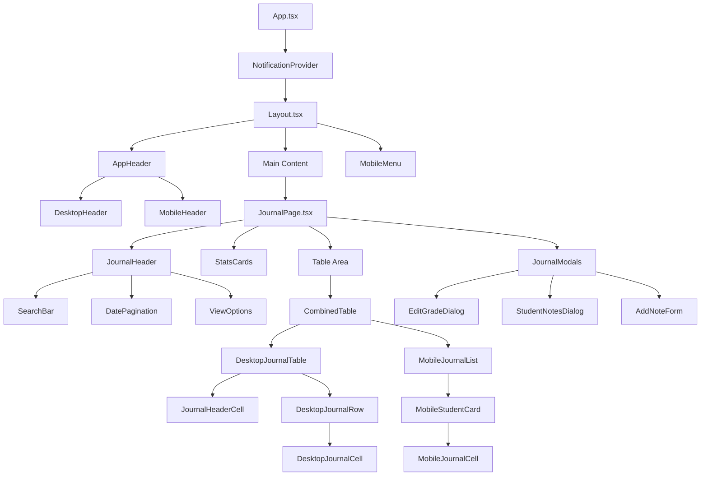
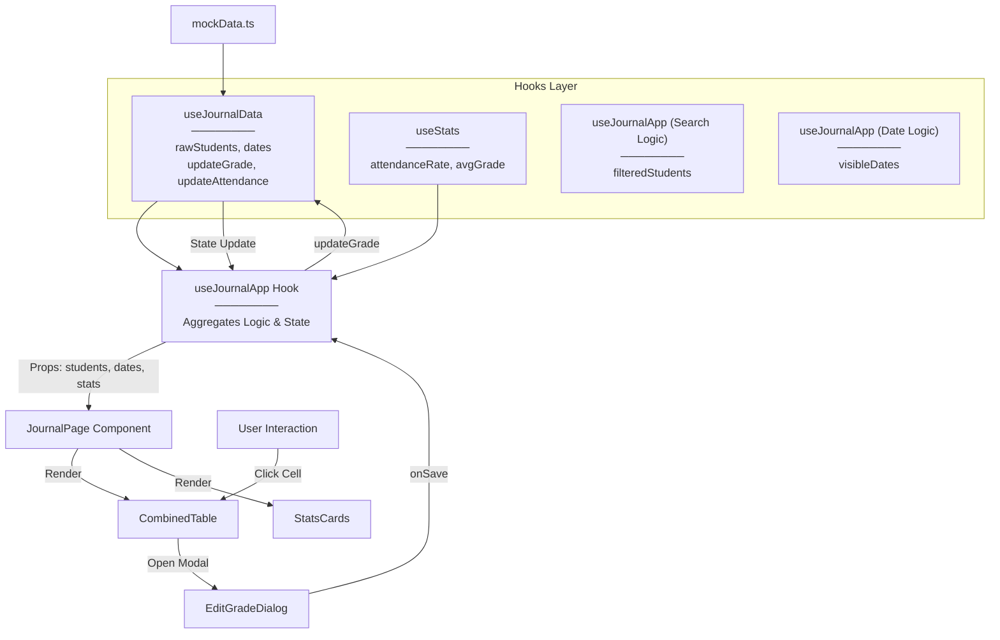

# 📚 VisitLog - Electronic Class Journal

Сучасний електронний журнал відвідування та успішності, побудований на **React + TypeScript + Vite**.
Додаток забезпечує інтуїтивний інтерфейс для викладачів, дозволяючи швидко відмічати відвідування, виставляти оцінки, переглядати статистику та керувати індивідуальними планами студентів. Адаптований для десктопних та мобільних пристроїв.

---

## Table of Contents

- [🚀 Стек технологій](#-стек-технологій)
- [📂 Структура проєкту](#-структура-проєкту)
- [🌳 Component Tree (CT)](#-component-tree-ct)
   - [Опис Component Tree](#опис-component-tree)
- [🔄 Data Flow Diagram (DF)](#-data-flow-diagram-df)
- [📋 Опис Data Flow](#-опис-data-flow)
- [🎨 Design Patterns](#-design-patterns)
   - [1. Composite Pattern (Component Composition)](#1-composite-pattern-component-composition)
   - [2. Custom Hook Pattern (Business Logic Separation)](#2-custom-hook-pattern-business-logic-separation)
   - [3. Container/Presenter Pattern](#3-containerpresenter-pattern)
   - [4. Provider Pattern (Context API)](#4-provider-pattern-context-api)
   - [5. Memoization Pattern (Performance)](#5-memoization-pattern-performance)
   - [6. Facade Pattern (Utils)](#6-facade-pattern-utils)
   - [7. Strategy Pattern (Conditional Rendering)](#7-strategy-pattern-conditional-rendering)
- [🔄 Типові сценарії використання](#-типові-сценарії-використання)
- [⚙️ Основні Hooks](#️-основні-hooks)
- [📌 Функціонал](#-функціонал)
- [🔧 Деталі реалізації](#-деталі-реалізації)

---

## 🚀 Стек технологій

- [Vite](https://vitejs.dev/) – швидкий збирач проєкту
- [React 18](https://react.dev/) – бібліотека для UI
- [TypeScript](https://www.typescriptlang.org/) – типізація коду
- [TailwindCSS](https://tailwindcss.com/) – стилізація
- [Shadcn UI](https://ui.shadcn.com/) (Radix Primitives) – доступні UI компоненти
- [Framer Motion](https://www.framer.com/motion/) – анімації інтерфейсу
- [Recharts](https://recharts.org/) – графіки та діаграми
- [Lucide React](https://lucide.dev/) – іконки
- [Date-fns](https://date-fns.org/) – робота з датами
- [jsPDF](https://github.com/parallax/jsPDF) – експорт даних у PDF

---

🔝 [Вернутися до змісту](#table-of-contents)

---

## 📂 Структура проєкту


```

src/
├── components/
│   ├── common/           # Загальні компоненти (Pagination, Search, Notifications)
│   ├── layout/           # Структура сторінки (Header, Layout, MobileMenu)
│   └── ui/               # Базові UI елементи (Button, Dialog, Input, etc.)
├── data/                 # Мокові дані (mockData.ts)
├── features/
│   └── journal/          # Основний модуль журналу
│       ├── components/
│       │   ├── controls/ # Кнопки керування, перемикачі режимів
│       │   ├── modals/   # Діалогові вікна (EditGrade, StudentNotes)
│       │   ├── stats/    # Компоненти статистики
│       │   └── table/    # Таблиця журналу (Desktop & Mobile версії)
│       ├── hooks/        # Логіка журналу (useJournalApp, useStats, etc.)
│       └── utils/        # Допоміжні функції модуля
├── types/                # TypeScript інтерфейси
├── utils/                # Глобальні утиліти (dateUtils, exportUtils)
├── App.tsx               # Кореневий компонент
└── main.tsx              # Точка входу

```

---

## 🌳 Component Tree (CT)



### Опис Component Tree

* **App.tsx** – огортає додаток у `NotificationProvider` для відображення глобальних повідомлень.
* **Layout** – визначає каркас сторінки: адаптивний хедер (`AppHeader`) та мобільне меню (`MobileMenu`).
* **JournalPage** – "розумний" контейнер, який ініціалізує хук `useJournalApp` та розподіляє дані між дочірніми компонентами.
* **JournalHeader** – містить елементи керування: пошук студентів, пагінацію по датах, налаштування відображення.
* **CombinedTable** – відповідає за рендеринг правильного виду таблиці залежно від пристрою (Desktop vs Mobile).
* **JournalModals** – централізоване місце для всіх модальних вікон (редагування оцінок, нотатки), що дозволяє уникнути забруднення DOM дерева.

---

🔝 [Вернутися до змісту](#table-of-contents)

---

## 🔄 Data Flow Diagram (DF)



---

## 📋 Опис Data Flow

1. **Джерело даних:** Початкові дані завантажуються з `mockData.ts` через хук `useJournalData`.
2. **Агрегація логіки:** Хук `useJournalApp` виступає як **Controller**. Він об'єднує:
* Дані студентів та оцінок (`useJournalData`).
* Обчислення статистики (`useStats`).
* Фільтрацію пошуку та пагінацію дат.
* Логіку режимів редагування (`useQuickMode`, `useGradeEditing`).


3. **Передача даних:** `JournalPage` отримує підготовлені дані та функції-обробники з `useJournalApp` і передає їх вниз по дереву компонентів через props (Context API тут не використовується для даних журналу, що робить потік даних явним).
4. **Зворотний зв'язок (Actions):**
* При кліку на клітинку викликається `handleCellClick`.
* Відкривається діалог редагування.
* Після збереження викликається метод `handleGradeUpdate` в `useJournalApp`.
* Це тригерить оновлення стану в `useJournalData`, що спричиняє ре-рендер інтерфейсу.


---

## 🎨 Design Patterns

### 1. Composite Pattern (Component Composition)

**Де використано:** `JournalPage`, `CombinedTable`.
**Суть:** Сторінка складається з менших, незалежних частин (`JournalHeader`, `StatsCards`, `DesktopJournalTable`). Це дозволяє легко змінювати макет без зміни логіки.

### 2. Custom Hook Pattern (Business Logic Separation)

**Де використано:** `useJournalApp`, `useStats`, `useIndividualPlans`.
**Суть:** Вся бізнес-логіка винесена з компонентів у хуки.

```typescript
// features/journal/hooks/useJournalApp.ts
export const useJournalApp = () => {
    // Вся складна логіка тут:
    // sorting, filtering, quick mode, pagination...
    return { ...data, ...handlers };
}

```

### 3. Container/Presenter Pattern

**Де використано:**

* **Container:** `JournalPage` (керує станом і логікою).
* **Presenter:** `StatCard`, `DesktopJournalCell` (отримують дані і просто відображають їх).

### 4. Provider Pattern (Context API)

**Де використано:** `NotificationProvider` (`src/components/common/NotificationProvider.tsx`).
**Суть:** Надає доступ до функції показу сповіщень (`addNotification`) з будь-якої точки додатку без "prop drilling".

### 5. Memoization Pattern (Performance)

**Де використано:** `useStats`, `useJournalApp` (фільтрація студентів).
**Суть:** Використання `useMemo` для запобігання важким перерахункам статистики та фільтрації при кожному рендері.

```typescript
const filteredStudents = useMemo(() => {
    return students.filter(s => s.name.toLowerCase().includes(searchQuery));
}, [students, searchQuery]);

```

### 6. Facade Pattern (Utils)

**Де використано:** `dateUtils.ts`, `exportUtils.ts`.
**Суть:** Спрощення складних операцій (форматування дат, генерація PDF) через прості функції-обгортки.

### 7. Strategy Pattern (Conditional Rendering)

**Де використано:** `CombinedTable.tsx`.
**Суть:** Динамічний вибір стратегії відображення (таблиця або список карток) залежно від ширини екрану.

---

🔝 [Вернутися до змісту](#table-of-contents)

---

## 🔄 Типові сценарії використання

### Сценарій 1: Виставлення оцінки (Desktop)

1. Викладач наводить курсор на клітинку студента.
2. Клікає по клітинці.
3. Відкривається `EditGradeDialog`.
4. Викладач обирає оцінку (або "Н" - відсутність) та опціонально додає коментар.
5. Натискає "Зберегти".
6. Таблиця оновлюється, статистика перераховується.

### Сценарій 2: Швидке відмічання (Quick Mode)

1. Викладач активує "Швидкий режим" (блискавка).
2. Інтерфейс спрощується.
3. Клік по клітинці циклічно змінює статус: `Присутній` -> `Н` -> `Присутній`.
4. Немає модальних вікон для швидкого потоку роботи.

### Сценарій 3: Додавання нотатки про студента

1. Клік на іконку нотаток біля імені студента.
2. Відкривається `StudentNotesDialog`.
3. Викладач додає нову нотатку (текст + тип: позитивна/нейтральна/негативна).
4. Нотатка зберігається і відображається в історії студента.

---

## ⚙️ Основні Hooks

| Hook | Призначення |
| --- | --- |
| `useJournalData` | Керує сирими даними (студенти, дати), емулює запити до API. |
| `useStats` | Обчислює середній бал, відвідуваність та успішність на основі даних. |
| `useJournalApp` | Головний хук-оркестратор. Об'єднує всі інші хуки. |
| `useQuickMode` | Логіка перемикання та роботи "швидкого режиму". |
| `useStudentNotes` | CRUD операції для нотаток студентів. |
| `useGradeEditing` | Логіка відкриття/закриття модалки редагування оцінки. |

---

## 📌 Функціонал

* **Адаптивний дизайн:** Повноцінна таблиця на Desktop та зручні картки на Mobile.
* **Керування відвідуванням:** Швидка фіксація пропусків ("Н").
* **Система оцінювання:** Підтримка різних типів занять (Лекція, Практика, Лаб).
* **Статистика:** Візуалізація успішності та відвідуваності в реальному часі.
* **Індивідуальні плани:** Можливість позначати студентів з індивідуальним графіком.
* **Нотатки:** Система коментарів та зауважень для кожного студента.
* **Експорт:** Генерація PDF звітів та Excel (CSV) файлів.
* **Пошук та Фільтрація:** Швидкий пошук студентів за ім'ям.

---

## 🔧 Деталі реалізації

### Стилізація та UI

Проєкт використовує **Tailwind CSS** для швидкої верстки. Компоненти `shadcn/ui` (на базі Radix UI) забезпечують доступність (a11y) та стабільну роботу інтерактивних елементів (діалоги, поповери, селекти).

### Експорт даних

Модуль `src/utils/exportUtils.ts` використовує `jsPDF` та `jspdf-autotable` для генерації професійних звітів, які включають таблицю успішності та зведену статистику.

### Робота з датами

Використовується бібліотека `date-fns` для локалізації (uk-UA) та маніпуляцій з датами (генерація днів тижня, форматування заголовків).

---

**🔝 [Вернутися до змісту**](https://www.google.com/search?q=%23table-of-contents)

```

```
